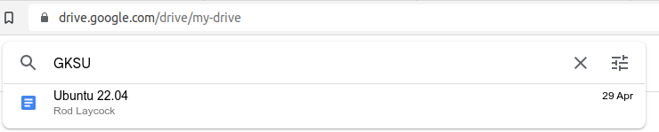

# Google
Let's start with the worst of the worst.  Google, they track your every search, read your emails, scan your calendar and a million other things in order to build a profile on you, so they can then target you with advertising.  It's the equivalent of glancing in a shop window at a hat, then every shop from then on only sells hats. If I wanted a hat, I would have gone into the hat shop and purchased one; not the butchers, or the shoe shop.

So what do I use in relation to Google services? This will give me an indication as to alternatives I need to remove Google from my, and if you are reading this, your life.  The following are in alphabetical order.

## Android
Mental note - looking at Google Pixel phone with Graphene installed.  All the Android - none of the Google!

## Authenticator

Google Authenticator is an application which stores 2FA codes to allow you to secure accounts by not only asking for a password, but also a code which rotates every 60 seconds. The code is displayed on the Authenticator application.  See [2 Factor Authentication (2FA)](../README.md) .

So how do I use it?  Well it's really simple, I open the app, add an account and scan the QR code.  It adds the account to my Authenticator app along with a code that rotates every 60 seconds.  When I want to use it, I open the app and type the 6 digit code before the 60 seconds elapses into the website I want to authenticate with.

So I removed my first dependency on a Google product. Google Authenticator is no more and has been replaced by a product called [Authy](https://www.authy.com). It's a free, open sourced, app which allows you to authenticate via multiple devices.  You can install it via the Play Store on Android or via their website (As we are removing dependency on Google - I would recommend the latter).

It's accessible via your phone number, so install it onto your mobile first, then onto your desktop.  It will send a message via Push Notification to the Authy app, which you can then accept.

It can add 2FA via QRCode, Barcode (via a plugin) or by typing in the key.

With the desktop application installed, you can authenticate directly from your desktop (something you cannot do with Google Authenticator). 

You can also set a master password and it will encrypt and backup your 2FA tokens for you.. Again, something not possible in Google Authenticator.

Give it a try - you won't be disappointed and you can take your first steps to removing a Google dependency.

## Browser / Chrome
Well this is an easy one - there are plenty of other browsers out there ranging from Chromium based (Chromium, Opera, Vivaldi, Brave, etc.) to trusty old Firefox and beyond.

For me - this is a no brainer, Firefox is written by the Mozilla Foundation, which is a non-profit organisation who work to ensure the Internet stays a public resource.

Their [manifesto](https://www.mozilla.org/en-GB/about/manifesto/) works to ensure that the Internet remains a public resource and is not taken over by the deepest pockets. 

[Mozilla Firefox](https://www.mozilla.org/en-GB/firefox/browsers/) is available on all platforms and has the title "Get the browsers that put your privacy first - and always have".

So switching from Chrome to Firefox was as simple as uninstalling Chrome and installing Firefox on Android and desktop.

## Calendar
Mental note: AllSync.com - 

## Documents / GSuite
Mental note: AllSync.com

## Drive
So it's now 15/10/22 and I have some time to do a large bit of this, removing all my documents from Google Drive, and whilst i am at it Microsoft's One Drive.

Let's just rollback why I am doing this, Google scans the documents you upload into their drive solution so they can index them for keyword searching.  Don't believe me? Log in and do a search:

So I have been playing with a new solution called Next Cloud. Where do I start with this; it's bloody fantastic.

[Next Cloud](https://nextcloud.com/) is an open source replacement for a lot of the tools Google and Microsoft use. It allows me to store documents and photo's, it has a calendar, it has contacts, chat, office tools and a myriad of other items.

You can host it yourself or buy Next Cloud hosting really cheaply in comparison to Microsoft and Google drives (see table below).

I have been playing with a Next Cloud provider called [All Sync](https://allsync.com/) and their prices are really, really cheap. Note: There are other providers which allow you to host Next Cloud, or you could buy / setup a Next Cloud instance in your home / office and run it yourself.

All Sync are based in the Netherlands and everything is encrypted on their servers and use end to end encryption, so there is no-one snooping on your files.

| Provider  | 5GB  | 10GB  | 15GB  | 100GB | 200GB | 500GB | 1TB   | 2TB   | 3TB   |
|-----------|------|-------|-------|-------|-------|-------|-------|-------|-------|
| AllSync   | N/A  | £0.07 | N/A   | £0.87 | N/A   | £1.73 | £2.60 | £3.47 | £4.34 |
| Google    | N/A  | N/A   | Free  | £1.59 | £2.49 | N/A   | N/A   | £7.99 | N/A   |
| Microsoft | Free | N/A   | N/A   | £1.99 | N/A   | N/A   | £5.99 | N/A   | N/A   |

As you can see - All Sync is really, really cheap!.

AllSync allow you to upgrade / downgrade at will - so if you are running out of space, you simply log in and upgrade. Conversely if you are not using all the disk space you can downgrade and save costs.

So how did I do this? Well first thing, I needed to download all my photo's and documents from Google onto my local drive

### Download all my documents
Log into [Google Drive](https://drive.google.com/) and click on one of the files / folders.

Press `CTRL` + `A` to select all the files and folders.

Click on the 3 dots and select `Download`

At the bottom you can see it states it's zipping up files and folders and will allow you to download it from within your browser.

Now - we just need to extract it onto our hard disk and start the task of deleting anything which we don't want to keep.

AllSync allows: Drive, Calendar, Office, Bookmarks, Tasks
NextCloud instance..

## Email
Mental note: ProtonMail

## Forms

## Hangouts
Mental note: Signal

## Keep
Mental note: AllSync.com 

## Search Engine
So this is another easy one, simply open your browser and in the address bar type "www.duckduckgo.com".

When the above is displayed (note, I use a dark mode theme so it might look lighter on your display) - type in the box in the middle "How do I set DuckDuckGo as default search in [enter name of browser]".  Find a link which is right for you and click it.

Congratulations - you have just searched for something and not been tracked across websites, doesn't that feel liberating?

I have been using DuckDuckGo for years, as Google store every search you ever do and use that to build up a profile on you in order to sell you things.  Don't believe me? Use Google and search for similar things over and over again "1/2 inch socket set", "socket set", "garage socket set", etc.  Then watch as more and more ads are served to you as company's try and sell you a socket set.

There are other search engines out there, some as good, some better some worse. Try them for yourself:

- [Quant](https://www.qwant.com/) - TBC
- [Star Page](https://www.startpage.com/) - TBC
- [Swiss Cows](https://swisscows.com/en) -  TBC
- [Mojeek](https://www.mojeek.com/) - TBC
- [Peekier](https://peekier.com/) "The most privacy-orientated search engine"
- [MetaGer](https://metager.org/) "Privacy Protected Search & Find".
- [Ecosia](https://www.ecosia.org/) The eco-friendly search engine, planting trees as you search.
- [Gibru](https://gibiru.com/) "The uncensored search engine" - Be careful what you search for ;)

All in all - there are other search engines, Google and Bing are not the only ones.. And these do not and will not track you, you information to target ads to you or invade your privacy.

Make the switch - this is the easiest thing you will ever do to break away from big tech companies.

## Photos
Mental note: AllSync.com 

## Play Store
So the second item on my list is the Google Play Store, not that a big a deal I think I can hear.. After all, it's just for downloading apps right? But let's think about this for a second.  Google are offering a free service, which allows anyone to create and host an application which can be downloaded onto their phone.  Applications can be free or the dev can charge for them - and there we have it.  In 2019 Google were forced to disclose their revenue for the Play Store, and it's eye watering.  A staggering $11.2 Billion (US) from direct sales, advertisement revenue and in app purchases.
Let's put this into perspective:

$11,200,000,000 / 365 days = $30,684,931 per day
$30,684,931 / 24 hours = $1,278,538 per hour
$1,278,538 / 60 mins = $21,308 per minute
$21,308 / 60 seconds = $355 per second

So why this is so profitable?  Advertisements.  Getting people to click on a link and possibly purchase a product of which some money goes back to the developer, some go to Google. 

Another reason why I don't want Google holding information on me, it stops them from making massive amounts of money by targeting people based on data.  Why should we give this information to them freely?

So what alternatives are there?  Well my first thought was F-Droid, it's a nice simple Play Store alternative with a lot of really good software you would not find on the Play Store, but it does lack some of the mainstream apps like Netflix, Spotify, Firefox... Although it does have VLC and Proton Mail (which I was pleased to see as I personally use both).

If you cannot find it on F-Droid, then [enable downloading and installing of APK's](https://duckduckgo.com/?q=how+to+install++apk&t=newext&atb=v332-1&ia=web) and head on over to [APK Mirror](https://www.apkmirror.com/) where you can download pretty much everything else.  I thought I'd really test it and see if my banking apps were there.  Some of the top high street banks are there:

MBNA
Lloyds Bank
Natwest
TSB

Others are still only on the Play Store (tisk tisk).

Alas - I cannot completely remove the Play Store until I've updated all my apps from other sources, so this one may take some time.. Stay tuned!

## Voice

## YouTube

