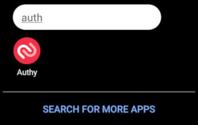

# Regain My Privacy
Plan / Software / Solution to regain my privacy online.

So here I am, 40+ and I have had enough of the Internet.  Well to be more accurate, I've had enough of Big Business (Google, Facebook, Amazon, Microsoft**) stealing my data, enough of Cookies tracking me from one site and trying to sell me stuff on another site. Enough of my phone tracking my every movement, analysing my every email, categorising my every photo and reading my every document.

** I do see the irony of hosting this on GitHub when it's owned by Microsoft.

So - Here I go.. I am going to plan, document and attempt to execute De-[Insert company name here] my life.  I am going to de-Google, de-Facebook and hopefully de-Microsoft my personal life.

As some of these systems just work collectively I want solutions which works the same, or as near as damn it.
e.g. I take a photo on my Android and it is backed up to my Photo storage / Drive, which is then searchable.  I put a postcode into maps and I get directions to it from my current location.  I ask my home assistant to remind me, add to a list, etc and it appears in the relevant application.

## Steps
1. Identify the main culprits which breach privacy.
2. Identify which services I use which are linked to said culprit.
3. Analyse requirements of the service, figure out what's needed in the alternative.  Does it connect to other services?
4. Locate alternatives and identify if they meet requirements in step 3, and any trade-offs I may need to sacrifice.
5. Install / configure / use and remove the offending service.

## Offenders
Being old enough to know a world without the Internet, I witnessed it's birth, I saw it take it's first steps and start to evolve into something beautiful. A world wide mechanism to share information, send images and text around the globe in seconds, not days. I watched during it's childhood as it changed the way we learn enabling us to locate information in seconds not hours.  I then reeled in horror as it hit puberty and turned into a teenager, with pornography, drugs, violence, advertisers, trackers, marketing, data theft and misuse, privacy breaches and all the other crap the Internet has spewed forth. I now weep at the monster that grew up so innocent.

And who is to blame for all this?  Well I can hardly blame porn, drugs and violence on any of the following - but I can and will blame them for all the other things that go on behind the scenes.

In my book the main offenders are:

1. [Google](./Google/README.md)
2. [Microsoft](./Microsoft/README.md)
3. [Facebook/Meta](./Facebook/README.md)
4. [Amazon](./Amazon/README.md)

Please feel free to suggest any further offenders.

# Essential Requirements

As we are now this far down the rabbit hole of privacy and security, there are a few essentials which I would not live without.

## VPN
A good VPN is essentials when using public access points, and even phone networks.

## Password Manager

Never reuse the same password over and over - it's asking for trouble. Find a really good Password Manager and stick with it.

The 2 options I have here are:
1. Local password manager installed on laptop, desktop, phone and synchronise the data file using some mechanism.
2. Online password manager which stores your data in the cloud.

As you can see, both have their flaws:
1. I need to synchronise the data file, probably using a cloud service - what if this gets hacked?
2. I need to store my usernames and passwords in the cloud, what if this gets hacked?

The best solution I have found is to use option 2 (Online password manager), but only store part of the password in there.  The other part of the password could be related to the site, account or some other information only known to you.

e.g. 
Your Amazon account has a password stored in your password manager which could be "Vitally6-Landing-Removing"

If the secret only known to you is to categorise the website and count the letters in it's base domain name (www.amazon.co.uk has 16 characters), then the true password could be

Vitally6-Landing-Removing_shopping16

Ensure you protect it with a really good key and you have a set of passwords which cannot be cracked (not in your lifetime anyway) and even if the password manager is compromised, it's still useless to anyone.

With this in mind I use [BitWarden](https://www.bitwarden.com), at $10 per year it allows for unlimited passwords and 2FA (see below).

## AdBlocker
What can I say - even after all of the above - Ads will still attempt to track you (go onto www.halfords.co.uk and search for anything, then visit almost any other website and you will see what I mean)

A good set of AdBlockers is essential, I use a all of the following:

[PrivacyBadger](https://privacybadger.org/)

## 2 Factor Authentication (2FA)
Absolutely essential - this is your early warning radar that someone is attempting to gain access to your accounts. 

If you are not familiar with 2FA, checkout [Wikipedia's article](https://en.wikipedia.org/wiki/Multi-factor_authentication) on it.

If an account is worth securing - it's worth using 2FA.  If it's not work securing - delete it!

I used to have Microsoft Authenticator and Google Authenticator on my phone.  2 apps, doing the same job, taking up space.  The problem here is that if you enable 2FA for Microsoft, you get instructions to download MS Authenticator and use that.  You then enable 2FA on your Google account and you get instructions to download and install Google Authenticator.  

This is where the problems start.  You enable 2FA on GitHub, DevOps or another account and then you open one of the apps and add it into there. 

At some point you will be saying "Which app did I install XXXXXXX 2FA onto?"

So I looked about for a single app which can do both and found [Authy](https://authy.com/). It's a nice little app, ad free, which just works. I can add all my accounts (and I have done) from Google Authenticator and Microsoft Authenticator into a single app and then removed the other 2.

You may need to disable 2FA on the site and then re-enable it, but it just works.

I have now removed all 2FA authenticators in favour of just the one.

Cleaner, nicer and I have now removed my first dependency on Microsoft and Google.